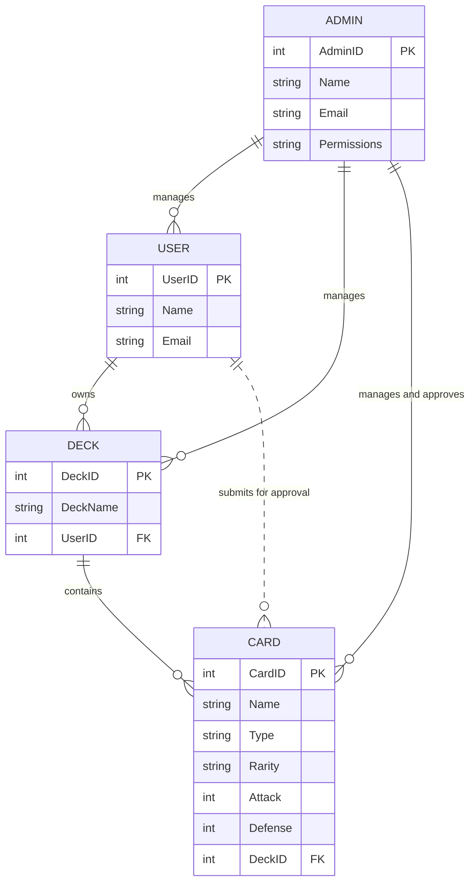
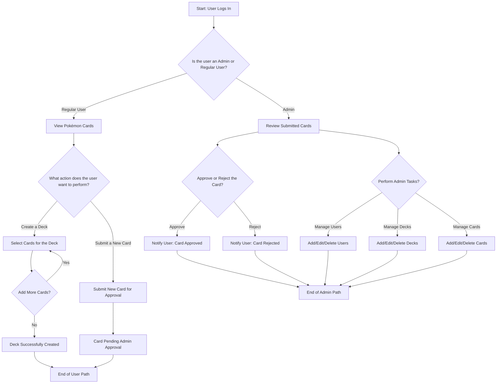
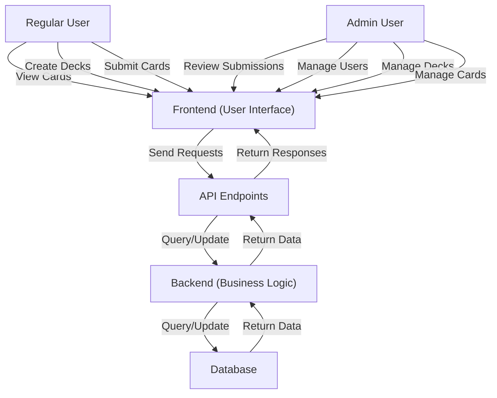

# Pokémon Card Storage Web App

## Overview
This project is a Pokémon Card Storage Web App that allows users to view, manage, and submit Pokémon cards, as well as assemble decks. Admins have additional privileges to approve and manage submitted cards, decks, and users.

---

## Features
### User Roles:
- **Users:**
  - View all Pokémon cards.
  - Submit new cards (pending admin approval).
  - Assemble and manage decks (add/remove cards).

- **Admins:**
  - Approve user-submitted cards.
  - Add new cards.
  - Modify and delete existing cards.
  - Manage users, decks, and cards.

---

## Entity-Relationship Diagram (ERD)

Below is the ERD diagram that represents the database structure for the Pokémon Card Storage Web App.

## User Flow Diagram

This diagram represents how users and admins interact with the Pokémon Card Storage Web App. It includes the following key interactions:
- **Users**: View cards, submit cards for approval, and manage decks.
- **Admins**: Approve cards, manage users, decks, and cards.

Below is the user flow diagram:

## System Architecture Diagram

This diagram illustrates the architecture of the Pokémon Card Storage Web App, highlighting the interactions between users, the frontend, backend, API endpoints, and the database. It ensures a clear understanding of how data flows and roles are managed within the system. Key components and interactions include:

- **Regular Users**:
  - View Pokémon cards.
  - Create decks by selecting cards.
  - Submit new cards for admin approval.

- **Admins**:
  - Review and approve or reject card submissions.
  - Manage users, decks, and Pokémon cards (add, edit, delete).

- **Frontend (User Interface)**:
  - The primary point of interaction for users and admins, handling inputs and displaying responses.

- **API Endpoints**:
  - Bridge the communication between the frontend and backend, ensuring secure and efficient data exchange.

- **Backend (Business Logic)**:
  - Implements the core functionality of the app, processing requests and enforcing rules.

- **Database**:
  - Stores all application data, including user accounts, card details, deck compositions, and submission statuses.

Below is the system architecture diagram:

## API Endpoints Table

This table lists the key API endpoints for the Pokémon Card Storage Web App. It includes the HTTP methods, descriptions, and authentication/authorization requirements.

| Endpoint               | HTTP Method | Description                               | Authentication Required | Authorization Level   |
|------------------------|-------------|-------------------------------------------|--------------------------|-----------------------|
| `/api/cards`           | GET         | Fetch all Pokémon cards.                 | Yes                      | Regular User/Admin    |
| `/api/cards/:id`       | GET         | Fetch details of a specific card.        | Yes                      | Regular User/Admin    |
| `/api/cards`           | POST        | Submit a new Pokémon card.               | Yes                      | Regular User          |
| `/api/cards/:id`       | PUT         | Update a Pokémon card's details.         | Yes                      | Admin                 |
| `/api/cards/:id`       | DELETE      | Delete a Pokémon card.                   | Yes                      | Admin                 |
| `/api/decks`           | GET         | Fetch all decks created by the user.     | Yes                      | Regular User/Admin    |
| `/api/decks/:id`       | GET         | Fetch details of a specific deck.        | Yes                      | Regular User/Admin    |
| `/api/decks`           | POST        | Create a new deck.                       | Yes                      | Regular User          |
| `/api/decks/:id`       | PUT         | Update details of an existing deck.      | Yes                      | Regular User          |
| `/api/decks/:id`       | DELETE      | Delete a deck.                           | Yes                      | Regular User/Admin    |
| `/api/admin/approve`   | POST        | Approve a submitted Pokémon card.        | Yes                      | Admin                 |
| `/api/admin/reject`    | POST        | Reject a submitted Pokémon card.         | Yes                      | Admin                 |
| `/api/admin/users`     | GET         | Fetch all user details.                  | Yes                      | Admin                 |
| `/api/admin/users/:id` | DELETE      | Delete a user.                           | Yes                      | Admin                 |
| `/api/admin/cards`     | GET         | Fetch all submitted cards for approval.  | Yes                      | Admin                 |